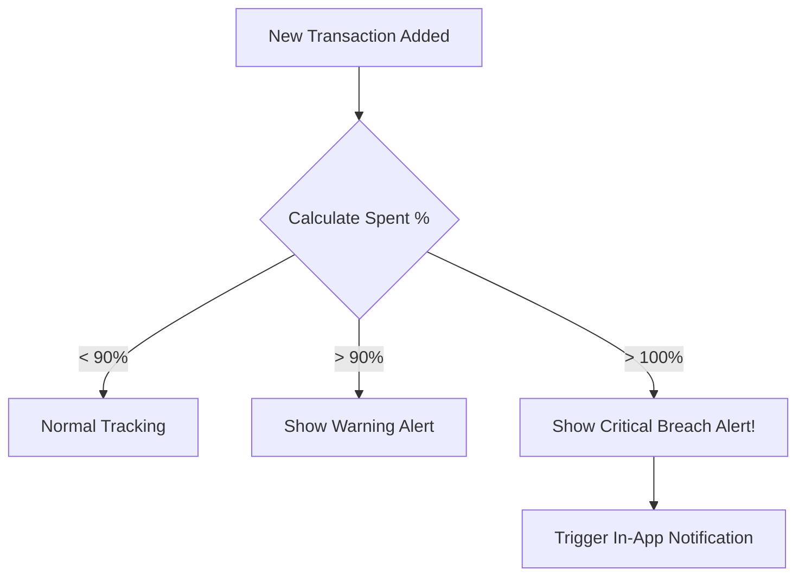

# Chapter 7: Smart Budget Planner

## 7.1 Budget Model Logic

The **Smart Budget Planner** is the predictive and preventative heart of Thrifty. While the Transaction Module records the *past*, the Budget Planner controls the *present* and protects the *future*.

### 7.1.1 Overview
In Thrifty, a `Budget` is a user-defined spending limit for a specific category (e.g., Food, Entertainment, Bills) over a period of time. It acts as a set of boundaries that keep your spending in check.

### 7.1.2 The "Smart" Component: Dynamic Sync
What makes this planner "Smart" is its real-time relationship with the `Transaction` module. There is no manual "updating" of your budget; the system recalculates your remaining funds the split-second a new transaction is recorded.

---

## 7.2 Spent Calculation

The "Spent" logic is the engine that drives the budget visualization. It uses a high-performance database aggregation to compute live totals.

### 7.2.1 The Calculation Flow
1.  **Filter by User**: Ensures you only see *your* budget data.
2.  **Filter by Category**: Matches your expenditures to the budget's specified category.
3.  **Summation**: Total all expenses where `type='expense'`.
4.  **Net Outcome**: Returns a single numeric value sent to the frontend.

---

## 7.3 Progress Bar UI

The **Progress Bar UI** is the visual feedback loop of the Thrifty app. It uses the "Glassmorphism" design system to create a premium, interactive experience.

### 7.3.1 Visual Structure
-   **Track**: A semi-transparent glass container.
-   **Fill**: A vibrant solid or gradient bar that grows as you spend.
-   **Label**: Displays the Category name and the numerical ratio (e.g., "₹850 / ₹1000").
-   **Percentage**: Shows a clean "85%" readout for quick scanning.

---

## 7.4 Color Coding

Thrifty uses **Dynamic Color States** to communicate financial health without requiring the user to read a single number. This is rooted in psychological urgency cues:

| Status | Color | Meaning |
| :--- | :--- | :--- |
| **Safe** | Neon Teal (`#2dd4bf`) | Spent < 60% of limit. You are well within your means. |
| **Warning** | Warning Yellow (`#fde047`) | Spent 60% - 90% of limit. It's time to slow down. |
| **Critical** | Panic Red (`#ef4444`) | Spent > 90% of limit. Stop all non-essential spending! |

---

## 7.5 Over-spending Alerts

The system doesn't just show colors; it actively communicates through the **Over-spending Alert** system.

### 7.5.1 Alert Triggers

### 7.5.2 Proactive Advice
When a budget is breached, the **AI Advisor (Module 10)** is triggered to offer contextual advice, such as:
*"You've spent 120% of your Entertainment budget. Consider skipping that movie tonight to stay on track for your New Laptop goal!"*

---
> [!TIP]
> **Finance Tip**: Set your "Essential" budgets (Rent, Electricity) first before allocating your "Discretionary" (Shopping, Gaming) budgets.
