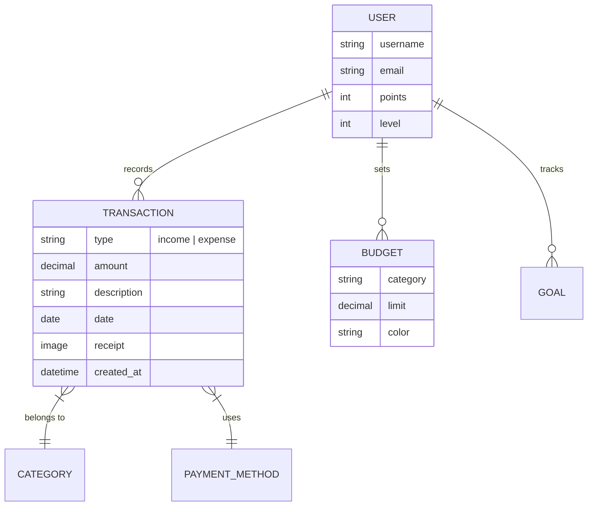
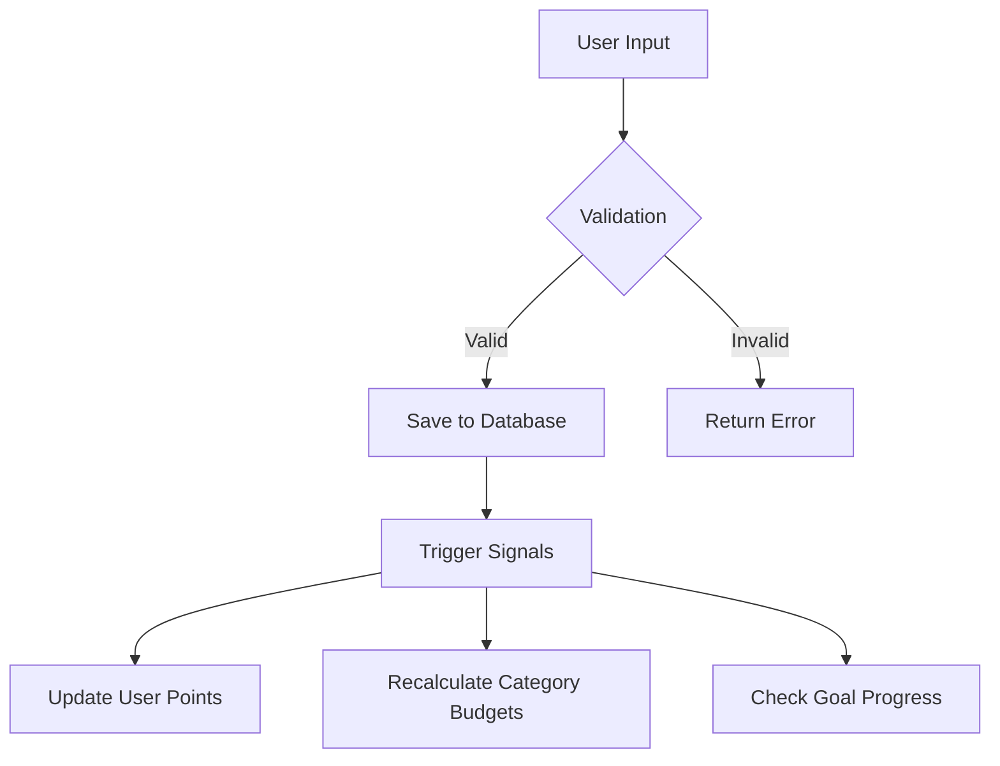
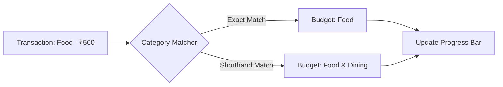

# Chapter 6: Transaction Module

## 6.1 Data Model Design

The **Transaction Module** is the core engine of the Thrifty application. It handles the recording, categorization, and tracking of every financial movement. A robust data model is essential for ensuring data integrity, supporting complex queries, and providing the foundation for analytical insights.

### 6.1.1 Overview of the Transaction Model

In Thrifty, a `Transaction` is any individual record of income or expense. Each transaction is tied to a specific `User` and contains metadata that allows for granular tracking and powerful searching.

### 6.1.2 Schema Definition

The `Transaction` model is implemented using Django's ORM and maps to an underlying SQLite table. Below is the detailed breakdown of the fields:

| Field | Data Type | Description |
| :--- | :--- | :--- |
| `user` | ForeignKey | Links the transaction to a specific user (One-to-Many). |
| `type` | CharField | Categorizes the transaction as either `income` or `expense`. |
| `amount` | DecimalField | The monetary value of the transaction (up to 10 digits). |
| `category` | CharField | Pre-defined categories (e.g., Food, Transport, Salary). |
| `payment_method` | CharField | Method used (e.g., Cash, Card, UPI, Net Banking). |
| `description` | CharField | A short memo or note describing the transaction. |
| `receipt` | ImageField | Optional upload of a photo/scan of the physical receipt. |
| `date` | DateField | The actual date the transaction occurred. |
| `created_at` | DateTimeField | Automatically recorded timestamp of when it was added to Thrifty. |
| `source_message` | TextField | Optional field to store the raw SMS/Notification if auto-parsed. |

### 6.1.3 Entity Relationship Diagram (ERD)

The following diagram illustrates how the `Transaction` entity relates to other core components of the Thrifty system:

### 6.1.4 Data Flow and Integrity

When a user creates a transaction, several backend processes are triggered:
1.  **Validation**: Ensures the amount is positive and the category exists.
2.  **Point Awarding**: Users earn points for consistent tracking (gamification logic).
3.  **Budget Synchronization**: The `spent` property in the `Budget` model dynamically calculates totals based on recorded transactions.

### 6.1.5 Why this Design?
-   **Decimal Accuracy**: Using `DecimalField` instead of `FloatField` prevents rounding errors common in financial calculations.
-   **Temporal Sorting**: The `-date` and `-created_at` ordering ensures the most recent and newly added transactions appear first in the UI.
-   **Local-First Optimization**: The schema is optimized for SQLite, ensuring high performance even in offline scenarios.

## 6.2 CRUD Workflows

The **CRUD (Create, Read, Update, Delete)** workflows define the operational lifecycle of every transaction in Thrifty. These workflows ensure that data is not only captured but managed effectively throughout its existence.

### 6.2.1 Create: Capturing Financial Events
The "Create" workflow is the primary entry point for data.
*   **Manual Entry**: Users fill out a form with amount, category, and description.
*   **Validation**: The system checks for required fields and positive amounts.
*   **Post-Processing**: Upon successful creation, the system triggers internal signals to update the user's total balance and award gamification points.

### 6.2.2 Read: Accessing Historical Data
The "Read" workflow is optimized for speed and clarity.
*   **List View**: Displays all transactions in reverse chronological order.
*   **Summary View**: Aggregates data to show "Total Income" vs. "Total Expenses" for the current period.
*   **Filtering**: Users can query data by specific categories or date ranges.

### 6.2.3 Update: Maintaining Accuracy
Financial tracking often requires corrections.
*   **Contextual Editing**: Users can modify any field (e.g., changing a "Shopping" category to "Education").
*   **Dynamic Sync**: When an amount is updated, the associated Budget and Goal progress bars automatically recalculate to reflect the change.

### 6.2.4 Delete: Data Control
The "Delete" workflow allows for the safe removal of records.
*   **Soft Deletion (Optional)**: While current logic performs a standard delete, the system is designed to handle balance reversals.
*   **Cleanup**: Removing a transaction automatically adjusts the global balance and category-specific spending totals.

## 6.3 Category Logic

**Category Logic** is the classification engine of Thrifty. It transforms raw transactions into meaningful insights by grouping them into financial silos. This allows users to visualize where their money is going and enables the "Smart Budget" system to function.

### 6.3.1 Hierarchical Structure
Thrifty uses a standardized set of categories to ensure consistency across the platform:
-   **Essential Expenses**: Food & Dining, Transport, Bills & Utilities, Health.
-   **Lifestyle Expenses**: Shopping, Entertainment, Education.
-   **Incomes**: Salary, Freelance, Investment.
-   **Miscellaneous**: Other.

### 6.3.2 Transaction-to-Budget Mapping
The intelligence of the module lies in how it links a **Transaction** to a **Budget** record. This is a dynamic calculation rather than a hard link in the database.

### 6.3.3 Matching Algorithms
To provide a smooth user experience, the system employs a two-tier matching logic:
1.  **Exact Match**: The system first looks for a budget category name that exactly matches the transaction's category key (e.g., `food` == `food`).
2.  **Shorthand/Partial Match**: If no exact match is found, it uses "Contains" logic. For example, a transaction categorized as "Transport" will automatically be counted against a budget named "Transport & Fuel."

### 6.3.4 Smarter Classification (Auto-Parsing)
When a user uploads a receipt or provides a bank SMS, the logic attempts to "Guess" the category based on keywords (e.g., "Starbucks" -> "Food", "Uber" -> "Transport"). This reduces manual friction and improves data accuracy.

---
> [!TIP]
> **Pro-Tip**: Use the `source_message` field for debugging automated SMS parsing. It provides a historical record of what the system read versus what it saved.
